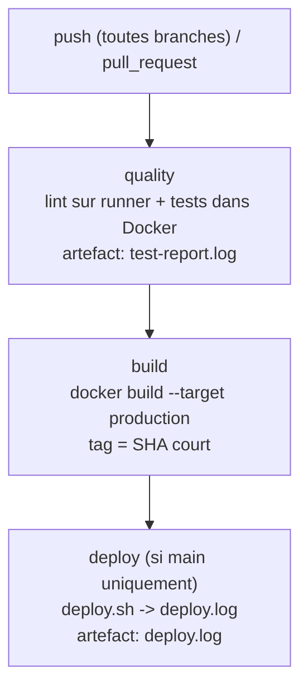

# TrustiPro — API CI/CD


URL du dépôt : https://github.com/ClubEpice/EC06_BarraultErwan

Chaîne CI/CD complète (Git, Docker, GitHub Actions) construite autour d'une mini API Express (Node.js 20) exposant `/`, `/health` et `/artisans`.

## 1. Workflow Git

Stratégie **GitFlow simplifiée** :
- `main` — code stable, protégé (règle de protection : PR obligatoire + force push interdit).
- `dev` — branche d'intégration où les features sont fusionnées.
- `feature/*` — branches de travail éphémères (une par sujet).

J'ai choisi cette stratégie parce qu'elle sépare clairement le code en production (`main`) du code en cours d'intégration (`dev`), tout en gardant les développements isolés sur des branches courtes. Chaque `feature/*` part de `dev`, est fusionnée par une Pull Request, puis `dev` est promu vers `main` par une PR dédiée.

**Utilisation des PR pendant l'épreuve** :
- `feature/dockerisation` → `dev` : mise en place du Dockerfile et de docker-compose.
- `feature/ci-pipeline` → `dev` : pipeline GitHub Actions + script de déploiement.
- `dev` → `main` : promotion vers la production, qui déclenche le job `deploy`.

Chaque PR comporte un titre clair et une description structurée (contexte / changements / comment tester). La CI se déclenche automatiquement sur les commits des branches feature, son statut est visible dans la PR.

## 2. Conteneurisation Docker

**Dockerfile multistage** (`node:20-alpine`) :
- **Étape `builder`** : `npm ci` installe *toutes* les dépendances (dont jest) et copie le code. Elle sert à préparer l'app et à exécuter les tests.
- **Étape `production`** : repart d'une base vierge, `npm ci --omit=dev` (uniquement `express` et `pg`), et ne copie que `src/`. Résultat : image ≈ 49 Mo (bonus < 200 Mo).

Choix expliqués :
- **Image de base `alpine`** : distribution minimale → image légère et surface d'attaque réduite.
- **Utilisateur non-root (`USER node`)** : si le conteneur est compromis, l'attaquant n'a pas les droits root. L'image officielle `node` fournit déjà cet utilisateur.
- **HEALTHCHECK** : Docker interroge régulièrement `GET /health` (en Node pur, car `curl` n'est pas présent dans alpine) et marque le conteneur `healthy` / `unhealthy` — utile pour l'orchestration.
- **EXPOSE 3000** : documente le port applicatif.

**docker-compose.yml** : service `app` (construit sur l'étape `builder` pour pouvoir lancer `npm test`), service `db` (PostgreSQL 16), volume nommé `trustipro_data` pour la persistance, variables chargées via `env_file: .env`. Le service `app` reçoit `DB_HOST=db` pour joindre la base par le DNS interne de compose.

> Note : le service `app` cible l'étape `builder` (avec jest) et non l'image `production` légère : c'est cette dernière que le job `build` de la CI construit et pourra pousser sur ghcr. On sépare ainsi l'image de dev/test de l'artefact de production.

## 3. Pipeline CI/CD



- **`quality`** : `npm ci` puis `npm run lint` sur le runner, puis les tests dans Docker (`docker compose run --rm app npm test`). Publie `test-report.log` en artefact. Échoue si le lint ou les tests échouent.
- **`build`** : construit l'image de production et la tague avec le SHA court du commit (`${GITHUB_SHA::7}`).
- **`deploy`** : conditionné par `if: github.ref == 'refs/heads/main'` → ne s'exécute **que** sur `main`. Lance `deploy.sh` (déploiement simulé) et publie `deploy.log`.

Le job `deploy` est skippé sur les branches feature et pendant les PR (où `github.ref` n'est pas `refs/heads/main`) : on ne déploie qu'après fusion sur `main`.

## 4. Gestion des secrets

Secrets utilisés (noms uniquement) : `POSTGRES_USER`, `POSTGRES_PASSWORD`, `POSTGRES_DB`.

- Définis dans **GitHub → Settings → Secrets and variables → Actions**.
- Injectés dans le job `quality` via la section `env:` avec `${{ secrets.NOM }}` — jamais écrits en clair dans `ci.yml`.
- GitHub masque automatiquement leurs valeurs dans les logs (`***`). On ne fait jamais `echo` d'un secret.

`.env.dist` (versionné) contient les **clés sans valeurs** ; `.env` (valeurs réelles) est dans `.gitignore` et **n'est pas versionné**. Vérifié avec :
```bash
git check-ignore .env    # renvoie .env  → bien ignoré
git ls-files .env        # vide          → jamais suivi
```
> `DB_URL` figure dans `.env.dist` par conformité au modèle de l'énoncé, mais n'est pas utilisé par le code (la connexion passe par `POSTGRES_USER/PASSWORD/DB` + `DB_HOST`).

## 5. Lancement et utilisation du projet

```bash
git clone https://github.com/ClubEpice/EC06_BarraultErwan.git
cd EC06_BarraultErwan
cp .env.dist .env        # puis renseigner POSTGRES_USER / POSTGRES_PASSWORD / POSTGRES_DB (+ DB_HOST=db)
docker compose up --build
```

Vérifier que l'app fonctionne :
```bash
curl localhost:3000/health
# attendu : {"status":"ok","database":"connected","timestamp":"..."}
curl localhost:3000/artisans   # liste des artisans
```

## 6. Ce qui n'a pas été fait / améliorations envisagées

- Push de l'image sur GitHub Container Registry (ghcr.io) sur `main` : *(à compléter selon ce que tu ajoutes)*.
- Garde-fou « PR vers main uniquement depuis dev » via un workflow dédié.
- Le warning jest « worker process failed to exit » (pool `pg` non fermé) pourrait être corrigé, mais le code applicatif n'est pas à modifier.
- Healthcheck applicatif plus poussé, tests d'intégration avec une vraie base, etc.
